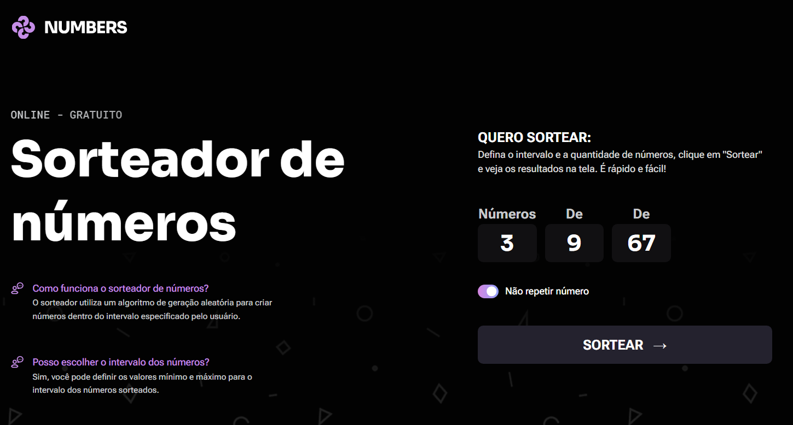

 

   

## 🎲 Number Drawer

Number Draw is a simple and intuitive online tool designed to generate random numbers quickly and accurately. Whether for a raffle, a game, or a decision-making process, the application allows users to draw up to 3 numbers within a customized range, with the option to repeat or not repeat numbers in the process.

## 👩‍💻 What I Learned

--> DOM Manipulation & Selection: I learned how to efficiently select and interact with HTML elements using querySelector and querySelectorAll.

--> Data Sanitization (Regex): I implemented real-time input cleaning using Regular Expressions (/\D/g) to ensure users can only type numbers.

--> Complex Validation Logic: I developed a validation system to handle range constraints (min/max), ensuring the minimum value is always lower than the maximum and preventing invalid inputs.

--> Random Number Generation: I mastered the use of Math.random() and Math.floor() to generate random integers within a specific range.

--> Data Structures (Set vs. Array): I practiced using the Set object to handle the "no repetition" logic, ensuring unique values in a draw, while using Arrays for standard draws.

--> Dynamic UI Updates: I learned how to toggle UI states by adding/removing CSS classes and updating innerHTML to switch between the input form and the results screen.

--> Event Handling: I used addEventListener to trigger functions on input, click, and form submission, providing a reactive feel to the app.

## ⚙️ Technologies Used
This project was developed using the following technologies:

- HTML
- CSS
- GIT E Github
- JavaScript

## 🏷️ Layout
Você pode visualizar o layout do projeto através [desse link](https://www.figma.com/community/file/1397279380752780744/sorteador-de-numeros).
É necessário ter uma conta no [Figma](https://www.figma.com).
